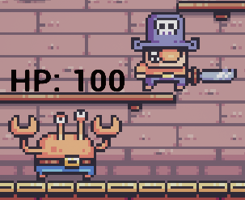
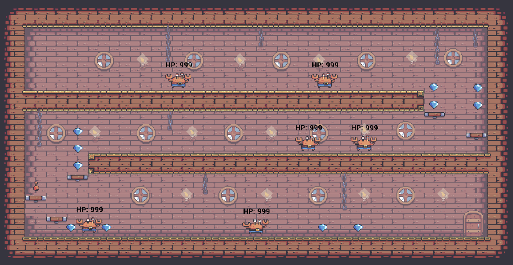

# CrustyPirates
Crusty Pirates is a 2D game about a pirate trying to escape from a hideout. The game was developed using Unreal Engine 5 and the base features were part of the course [Unreal Engine 2D: Make Your Own Epic 2D Games Using C++](https://www.udemy.com/course/unreal-engine-2d/)
from [GameDev.tv](https://www.gamedev.tv)

## Base Game
The base game consists of three levels where the pirate needs to defeat the crabbies to advance trhough levels

The pirate can collect diamonds and must reach the exit door to go to the next level

### Collectables
The game includes three types of collectables, each with different effects

**Diamond:** The Diamond increases the player score

**Healing Potion:** The Healing Potion increases the player health by 25.

**Golden Skull:** The Golden Skull is a Power Up that enables double jump.

### HUD
**Main**: The main HUD displays information about the collectables, diamonds and current level

**Enemy**: The enemy HUD displays the HP left for the enemy

**Win Screen**: The win screen widget appears when the player completes the game. It contains two
buttons, one to quit the game and other to play again

### Level Design
Each level is designed with an increasing platforms challenge and more enemies

**Level 1**

**Level 2**

**Level 3**

## Improvements
In addition to the base game features, I implemented some other that I considered could add to the
game

### Gameplay
* The player needs to defeat all the enemies before moving to the next level
* The healing potions can't increase the player's HP over the maximum cap
* Enemies attack faster on each level

### Level Design
A boss fight was included in the last level right before the final door. The boss enemy is bigger, has more HP, attacks faster and deals more damage than the regular enemies

### HUD
**Win Screen**: Display the amount of diamonds collected by the player

**Tutorial**: I included a tutorial screen to show the player how to play

### Sounds
I added a couple of royalty free sounds to improve the game's atmosphere

- **Background Music**: [Helpumeuwow - Ghost Pirate Hideout](https://www.youtube.com/watch?v=WCbV_3hgwTI)

- **Door Open Effect**: [The Sound Pack Tree - Old Wooden Room Door Open | Sound Effect](https://www.youtube.com/watch?v=L7M9RAX9q6Q)
